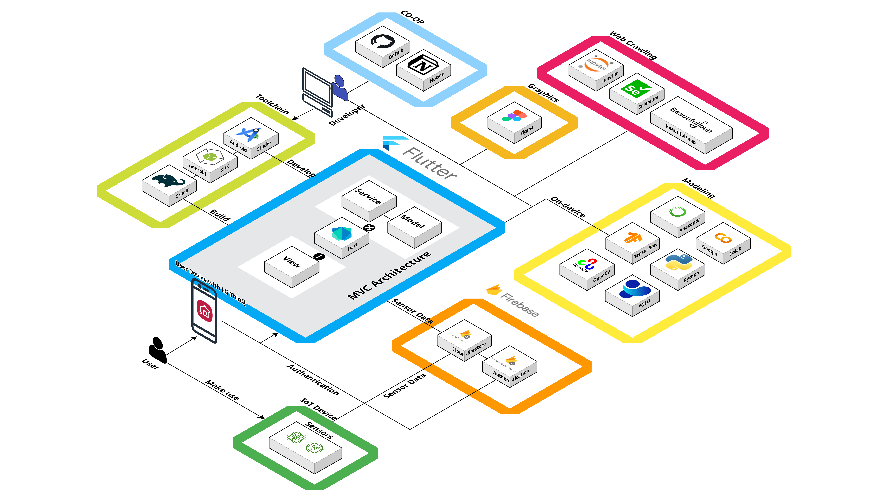

# 뉴젠 with LG ThinQ

## 목차

1. [**프로젝트 개요**](#프로젝트-개요)
2. [**기획**](#기획)
3. [**기술 스택**](#기술-스택)
4. [**프로젝트 구성도**](#프로젝트-구성도)
5. [**서비스 소개**](#서비스-소개)
6. [**의의**](#의의)

## 프로젝트 개요
### 진행 기간
2024.11.07 - 2024.12.05
 

 

### 팀원 소개
<table align="center">
  <tr>
    <td width="33%" align="center">
      <a href="https://github.com/thatisme">김근호</a>
    </td>
    <td width="34%" align="center">
      <a href="https://github.com/yunha-p">박윤하 (팀장)</a>
    </td>
    <td width="33%" align="center">
      <a href="https://github.com/wcdyg">손영균</a>
    </td>
  </tr>
  <tr>
    <td width="33%" align="center">
      
    </td>
    <td width="34%" align="center">
      
    </td>
    <td width="33%" align="center">
      
    </td>
  </tr>
  <tr>
    <td width="33%" align="left">
      - 기획 
      - 데이터 수집 및 분석 
      - 머신러닝 모델링 
      - 백엔드/프론트엔드 개발 
      - 산출물 작성 
    </td>
    <td width="34%" align="left">
      - PM 
      - 기획 
      - UX/UI 설계 
      - 프론트엔드 개발 
      - 산출물 작성 
      - 발표 
    </td>
    <td width="33%" align="left">
      - 기획 
      - 데이터 수집 및 분석 
      - 데이터베이스 설계 
      - 백엔드 개발 
      - 산출물 작성 
    </td>
  </tr>
</table>

 

## 기획
### 추진 배경
- 음식물 처리기 시장은 급성장 중이며, 지자체 보조금 지원으로 가전 시장의 블루오션으로 주목받고 있는 상황
- 현재 중소기업이 시장은 선점하고 있지만, LG전자와 삼성전자 등 대기업이 본격적으로 시장 진출을 시작
- LG전자는 2025년 미생물 하이브리드 음식물 처리기를 출시할 예정이며, 안산시 시범 사업을 통해 기술력을 검증하고 있는 상태
 

### 목표
<h4>"불쾌한 음식물 처리 경험을 상쾌한 주방 생활로!"</h4>
뉴젠과 ThinQ의 만남으로, 위생적이고 편리한 미생물 음식물 처리 경험을 제공하여 더욱 쾌적한 주방 생활을 선사

 

## 기술 스택📚

 
   

 

 
 
 

 

 

## 프로젝트 구성도
### 시스템 아키텍처

    

 

### 유스케이스

 

### 서비스 흐름도

 

### 데이터베이스 설계도

 

## 서비스 소개
### 주요 기능
#### 1. 회원가입
- 이름과 이메일 주소 그리고 비밀번호를 입력하면 입력창에서 바로 유효성 검사가 진행되고 통과하지 못한 경우 각 경고 문구가 입력창 하단에 표시됩니다.
- 이메일 주소의 형식이 유효하지 않거나 이미 가입된 이메일일 경우 또는 비밀번호가 6자 미만일 경우에는 각 입력창 하단에 경구 문구가 나타납니다.
- 작성이 완료된 후, 유효성 검사가 통과된 경우 다음 버튼이 활성화되며, 버튼을 클릭하면 프로필 설정 화면이 나타납니다.

| 회원가입 |
|----------|
||

 

#### 2. 로그인
- 가입한 계정의 아이디와 비밀번호를 입력하면 아래 로그인 버튼이 활성화됩니다.
- 활성화된 버튼을 클릭하면 데이터베이스에 등록된 정보인지 인증을 진행합니다. 
- 인증을 통과할 경우 다음 화면으로 넘어갑니다.

| 로그인 |
|----------|
||

 

#### 3. 홈화면
- 조회가 완료된 등록 기기의 전원 상태를 버튼을 클릭하여 제어할 수 있습니다. 
- 전원이 켜진 기기는 카드의 색상이 밝아집니다.
- 전원이 켜진 기기의 경우 카드를 클릭하게 되면 다음 화면으로 넘어갑니다.

| 홈화면 |
|----------|
||

 

#### 4. 작동 모드 원격 제어
- 작동 모드에 있는 버튼들을 통해 사용자가 기기의 모드를 원격으로 제어할 수 있도록 지원합니다.
- 총 3가지 모드가 있으며, 외출/절전/세척 모드를 선택할 수 있습니다.

| 원격 제어 |
|----------|
||

 

#### 5. 배양토/교반통 모니터링
- 측정한 수치를 기반으로 배양토 또는 교반통의 상태가 정상/비정상인지 사용자에게 알려줍니다. 
- 배양토/교반통 카드를 클릭하여 실시간으로 측정하고 있는 수치 정보를 세부적으로 확인할 수 있습니다. 

| 배양토/교반통 모니터링 |
|----------|
||

 

#### 6. 배양토 재고 소진 및 관리 알림
- 배양토 잔량이 기준치 이하거나 이상일 경우 경고 알림으로 팝업창이 등장합니다.

| 배양토 알림 |
|----------|
||

 

#### 7. 부산물 비움 알림
- 부산물이 적재 가능한 총 용량에서 일정 기준치를 넘어설 경우에 경고 알림으로 팝업창이 등장합니다.
- 부산물이 정리되지 않고 계속 늘어나는 경우에도 팝업창이 등장합니다.

| 부산물 비움 알림 |
|----------|
||

 

#### 8. 부산물 비움 알림
- 부산물이 적재 가능한 총 용량에서 일정 기준치를 넘어설 경우에 경고 알림으로 팝업창이 등장합니다.
- 부산물이 정리되지 않고 계속 늘어나는 경우에도 알림이 등장합니다.

| 부산물 비움 알림 |
|----------|
||

 

#### 9. 유용한 기능 지원
- 음식물 분류 가이드 : 투입 가능한 음식물 관련 정보를 제공합니다.
- 미생물 활용 가이드 : 미생물을 효율적으로 관리하는 방법과 현재 관리중인 미생물 상태에 대한 정보를 제공합니다.
- 소모품 정보 : 제품 유지/관리에 필요한 소모품의 구입 경로를 연결합니다.
- 가전세척 서비스 신청하기 : 서비스 신청 사이트로 연결합니다. 

| 음식물 분류 가이드 | 미생물 활용 가이드 |
|----------|----------|
||
|

| 소모품 정보 | 가전세척 서비스 |
|----------|----------|
||
|

 

#### 10. AI 푸드 스캐너 
- 제품에 투입 가능한 음식물을 AI 기능을 활용하여 사용자에게 간편히 알려주는 기능입니다. 
- 사용자가 판별하고 싶은 음식물을 실시간 촬영/이미지를 통해 스캔하여 이를 토대로 분석한 결과를 사용자에게 제공합니다.   

| 실시간 | 이미지 |
|----------|----------|
|||

 

#### (별첨) Floating Action Button
- 기능 시연을 위해 상황 부여를 담당하는 FAB입니다.
- 제품에 특정 음식물들을 투입하는 상황을 부여하며, 해당 상황을 통해서 부산물 증가/배양토 높이 증가/경고 알림 등 실시간 모니터링을 필요로 하는 기능이 정상적으로 작동하는지 살펴볼 수 있습니다.
- 직관적인 시연을 위해 FAB을 유동적으로 움직일 수 있습니다.   

| FAB |
|----------|
||

 

### 시연 영상

## 트러블슈팅
#### AI 푸드 스캐너
- Flutter 프레임워크에서 YOLO 검출 모델을 온디바이스로 활용할 수 있도록 지원하는 패키지들 대부분이 현재 개발중인 환경과 호환되지 않았던 문제
  - flutter_vision 패키지가 비교적 최근까지 업데이트가 이루어진 상태였지만 빌드로 돌입하면 여전히 일부 Native 환경과 충돌이 발생
  - android > settings.gradle 파일에서 "com.android.application"의 버전을 7.3.0으로 조정 후 해결
- 모델링 과정에서 학습 결과물의 성능이 기대 이하로 나오는 문제
  - Fine-tuning 과정에서 휴리스틱 기법을 활용하여 최적의 Hyperparameter 값을 탐구
  - 추가 라벨링을 통해 학습하고자 하는 음식물 이미지 데이터 추가
    
## 프로젝트 소감

### 😴김근호
일단 자고 생각할 예정

<!-- ## 의의
### 차별점

 

### 기대 효과
  -->
